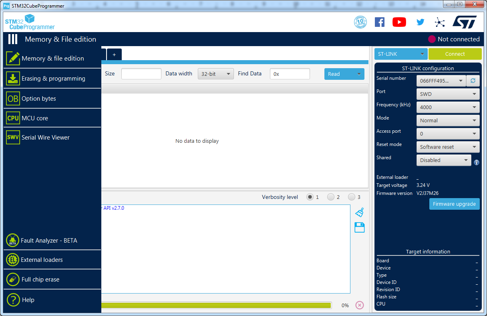
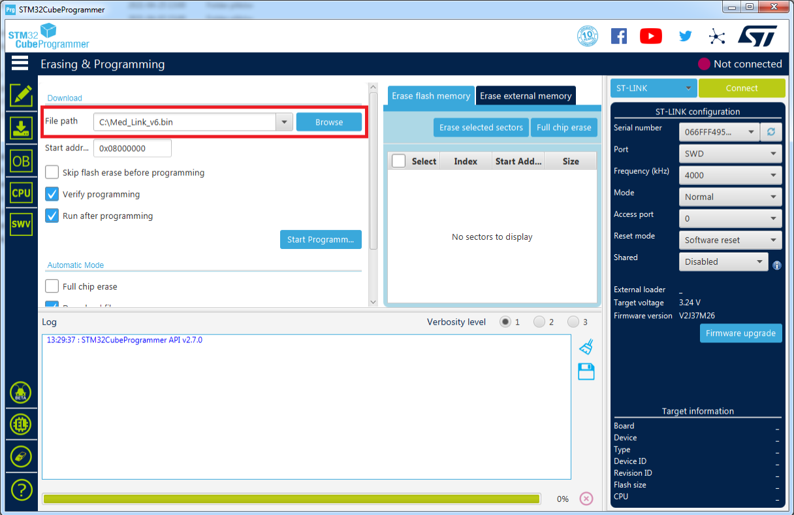
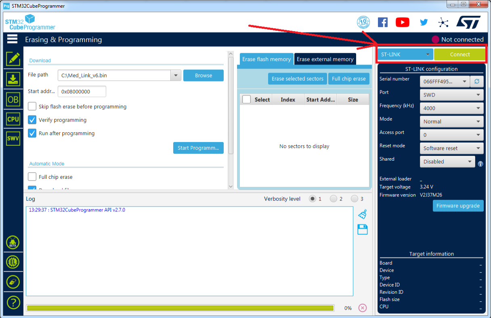
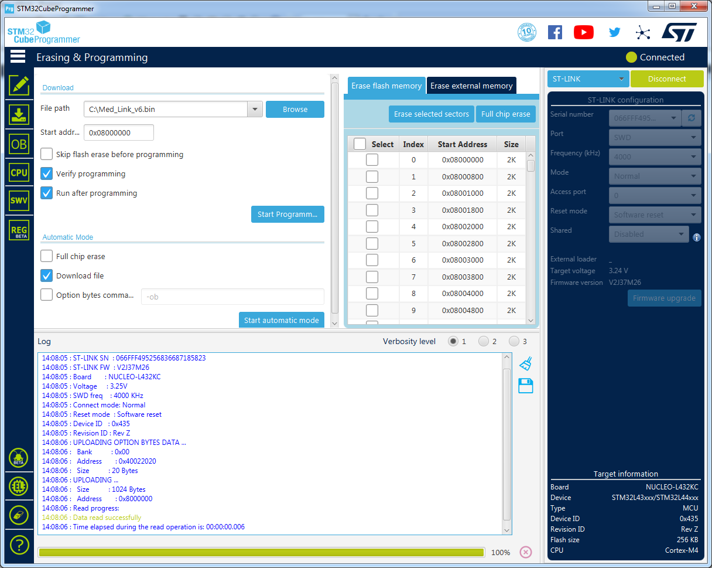
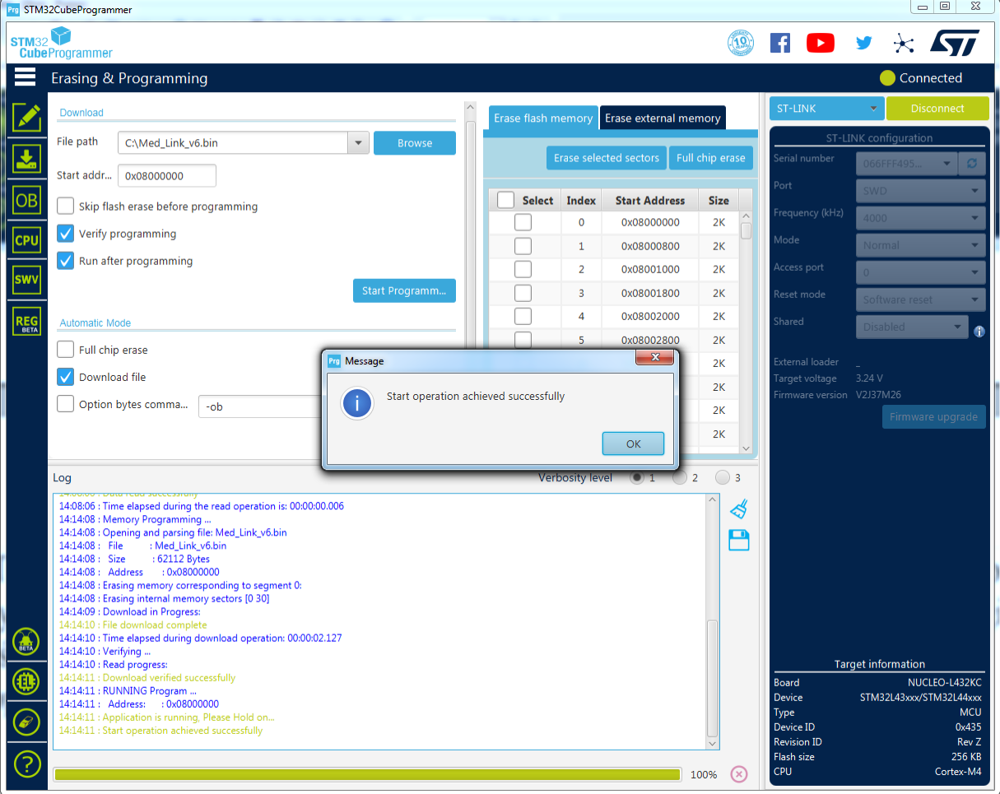
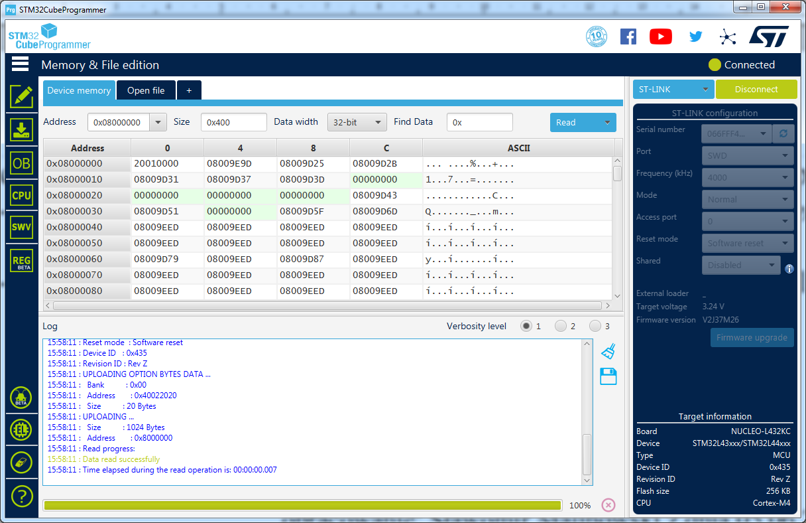
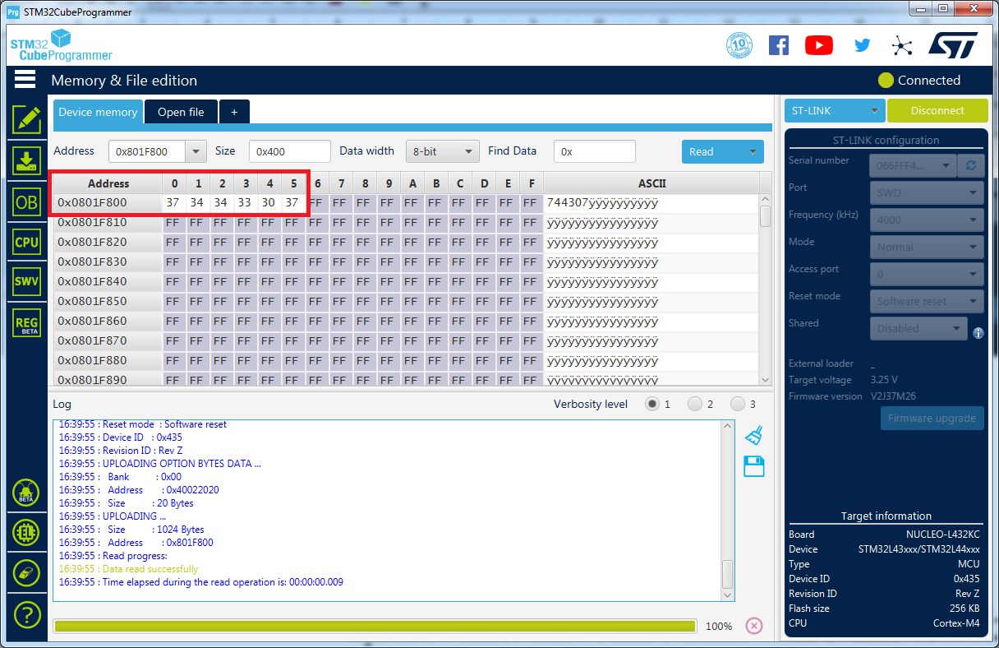

## Instrukcja programowania pilota Med-Link v6     z mikrokontrolerem STM32L432KC Nucleo
Potrzebne darmowe oprogramowanie ściągniemy ze strony producenta mikrokontrolera:
https://www.st.com/en/development-tools/stm32cubeprog.html

Wymagane będzie podanie swojego adresu email, na który przyjdzie link do pobrania programu STM32CubeProgrammer. Instalację można wykonać na domyślnych ustawieniach instalatora. Należy zezwolić na instalację sterowników. Płytka Nucleo ma wbudowany programator / debugger, więc wystarczy podłączyć port microUSB z płytki do gniazda USB komputera.

Widok okna programu po uruchomieniu:

Po lewej stronie są rozwijane zakładki z opisem do czego służą:

W zakładce "Erasing & programming" należy wskazać pobrany z githuba plik wsadowy z programem dla pilota v6, Med_Link_v6.bin:

W prawym górnym rogu wybrać typ połączenia "ST-LINK" i nawiązać połączenie z płytką Nucleo przez kliknięcie "Connect":

STM32CubeProgrammer automatycznie nawiąże i rozpozna podłączoną płytkę Nucleo oraz wyświetli szczegółowe informacje w okienku z logiem.
Jeśli połączenie jest prawidłowe, pozostało już tylko wgranie pliku poprzez kliknięcie w ikonę "Start Programm...". Procedura wgrania pliku jest bardzo szybka i jeśli weryfikacja przebiegła pomyślnie, to można zamknąć okienka o sukcesie poszczególnych operacji i zamknąć cały program STM32CubeProgrammer. 

Aby nieco ułatwić użytkownikowi zapisanie własnego numeru pompy zrobimy to wprost z programu  STM32CubeProgrammer bez testowania komunikacji z pompą. Błędnie wpisany numer zawsze można poprawić.

Procedura zapisania do pamięci FLASH 6-cyfrowego numeru ID pompy:

    • uruchomić STM32CubeProgrammer i nawiązać połaczenie poprzez kliknięcie "Connect"
    
    • w zakładce "Memory & File edition" domyślnie otwiera się panel "Device memory"
    
    • od adresu 0x8000000 zaczynają się komórki pamięci FLASH, aby nie zabierac pierwszych dostępnych komórek przechodzimy na zakres Page63
      który zaczyna się od adresu 0x801F800 oraz zmieniamy sposób wyświetlania na wartości o długości 8 bitów wg poniższego screena
      
    • w polu "Address" skopiować i wkleić wartość 0x801F800, w polu "Data width" wybrać długość 8-bit
    

Domyślnie wszystkie komórki na tym zakresie są zapisane wartościami 0xFF,  STM32CubeProgrammer pozwala bezpośrednio zapisywać na poszczególnych komórkach własne wartości. Tutaj należy się posługiwać wartościami hex, więc aby program rozpoznał zapisane na każdej pozycji cyfry trzeba do swojej cyfry z numeru pompy dodać 0x30. A najprościej można to zrobić w sposób: każda wpisana wartość ma mieć na pozycji dziesiątek cyfrę "3" a na pozycji jedności cyfrę z numeru pompy.
Przykładowo poniżej numer pompy 744307. Wpisanie dla każdej komórki swojej wartości polega na dwukrotnym kliknieciu myszką w komórkę, wtedy zacznie migać kursor, wpisać własną wartość komórki i zatwierdzić Enterem. Pole wpisywania przy migającym kursorze jest praktycznie wąskie i niewidoczne, więc wpisana wartość w zasadzie widoczna jest dopiero po zatwierdzeniu Enterem. Po zapisaniu w taki sposób wszystkich niezbędnych komórek dokładnie ze wskazanej wierszem i kolumnami lokalizacji spowoduje trwały zapis swojego numeru pompy w pamięci pilota. Na koniec zrobić rozłączenie programatora poprzez kliknięcie w "Disconnect" i zamknąć  STM32CubeProgrammer. Powodzenia!

opracowanie: Sławomir Malinowski z dnia 12.06.2021
